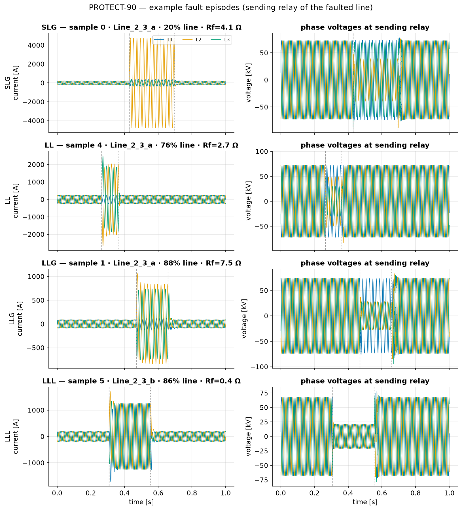
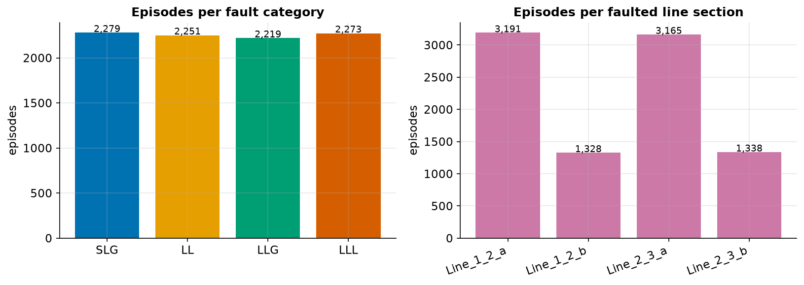
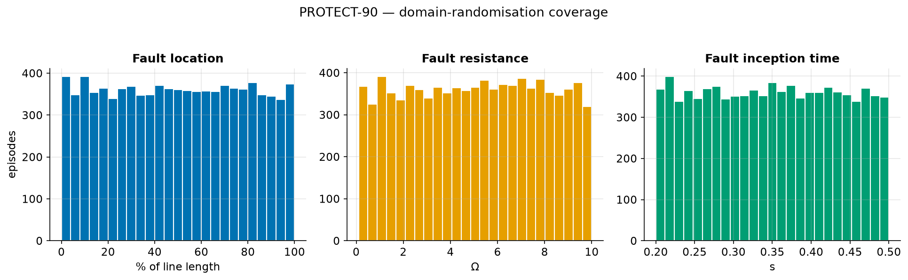

# PROTECT-90: A Fault Dataset for Power System Protection

Open, EMT-simulated high-voltage fault-waveform dataset for transparent and reproducible power-system protection research.

[](https://doi.org/10.5281/zenodo.18418330)
[](LICENSE)
[](https://creativecommons.org/licenses/by/4.0/)

[](#citation)
[](https://arxiv.org/abs/2606.24298)

This repository is the **showcase and documentation** for PROTECT-90. It points to two separate,
independently citable artifacts — please don't conflate them:

> 📦 **The dataset** — the waveforms + metadata, published on **Zenodo** under
> **DOI [10.5281/zenodo.18418330](https://doi.org/10.5281/zenodo.18418330)** (v0.1.0; concept DOI
> `10.5281/zenodo.18418329`), licensed **CC BY 4.0**. *This is what you download and use.*
>
> 📄 **The paper** — *"PROTECT-90: A Fault Dataset for Power System Protection,"* which describes and
> motivates the dataset, **accepted at IEEE PES ISGT Europe 2026** (Budapest, Hungary, Oct 19–22 2026;
> IEEE DOI to be assigned). Preprint available now: **[arXiv:2606.24298](https://arxiv.org/abs/2606.24298)**.
> *This is the scholarly reference for the dataset's design.*

See [Citation](#citation) for how to cite each. **PROTECT-90** comprises **9,022 physically consistent electromagnetic-transient (EMT) simulation
episodes** on a standardized **90 kV double-line** topology, with synchronized three-phase voltage and
current waveforms recorded at **eight measurement locations (48 channels)** at **6.4 kHz**. Every episode
is generated under *physically constrained domain randomization* of grid operating points, line
parameters, and fault conditions, and is released with structured, machine-readable metadata. All
modeling assumptions and parameter bounds are explicitly documented for cross-study comparability.

> 👉 **Start with [`explore.ipynb`](explore.ipynb)** — a guided tour that loads the data, explains the
> schema, and reproduces every figure below straight from the release.

---

## At a glance

| Property | Value |
|---|---|
| Episodes | **9,022** fault scenarios (no non-fault class) |
| Per episode | pandas DataFrame **(6,400 samples × 49 columns)**, one `.pkl` file |
| Sampling rate | **6.4 kHz** (128 samples per 50 Hz cycle); 10 µs fixed-step EMT solver |
| Episode duration | **1.0 s** analysis window (after a 0.1 s warm-up) |
| Channels | **48** = 8 relay locations × (3 phase currents + 3 phase voltages), plus 1 `time_s` column |
| Measurements | ideal three-phase V/I signals — no CT/VT instrument-transformer models |
| Topology | **90 kV double-line** — buses 1–2–3, four line sections (`Line_1_2_a/b`, `Line_2_3_a/b`) |
| Fault types | SLG, LL, LLG, LLL (≈ uniformly distributed) |
| Simulator | DIgSILENT PowerFactory (EMT mode) |
| Archive size | ~12.5 GB compressed, ~31 GB uncompressed; metadata CSV ~7.3 MB |
| Missing values | none |
| License | dataset: **CC BY 4.0** · this repo's code: **MIT** |
| DOI | [10.5281/zenodo.18418330](https://doi.org/10.5281/zenodo.18418330) (v0.1.0) · concept: `10.5281/zenodo.18418329` |

---

## Get the data

Download from Zenodo: **https://doi.org/10.5281/zenodo.18418330**

After extracting the preprocessed archive you get this layout:

```
<DATA_DIR>/
├── hv_double_line_90kv_labels.csv                    # per-episode metadata (9,022 rows)
└── hv_double_line_90kv_preprocessed_data/
    └── {sample_id}_sample_hv_double_line_90kv.pkl    # one DataFrame per episode
```

## Quickstart

```python
import pandas as pd

meta = pd.read_csv("hv_double_line_90kv_labels.csv")          # 9,022 episodes
ep   = pd.read_pickle(
    "hv_double_line_90kv_preprocessed_data/0_sample_hv_double_line_90kv.pkl"
)                                                             # (6400, 49)

print(ep.shape)                       # (6400, 49)
print(ep.columns[0])                  # time_s  (0 .. 1.0 s)
print(ep["Bus_2_Line_02_03A_cur_L1_A"].head())   # phase-A current at the Bus-2 relay of Line_2_3_a
```

Run `pip install -r requirements.txt` and open [`explore.ipynb`](explore.ipynb) for the full walkthrough.

---

## Schema

### Episode DataFrame — `(6400, 49)`

| Column(s) | Description |
|---|---|
| `time_s` | time axis, 0 → 1.0 s in steps of 1/6400 s |
| 48 channel columns | instantaneous three-phase currents [A] and voltages [V] |

The episode tensor can be read as `X ∈ ℝ^(8 × 6 × 6400)` — 8 relay locations × 6 channels (Iabc + Vabc)
× 6,400 time steps. Channel names are self-describing:

```
Bus_{bus}_Line_{from:02d}_{to:02d}{A|B}_{cur|vol}_L{phase}_{A|V}
```

e.g. `Bus_2_Line_02_03A_vol_L3_V` = phase-L3 voltage at the **Bus-2** relay of line section
**`Line_2_3_a`**. The 8 measurement locations are the sending (S, lower-numbered bus) and receiving
(R, higher-numbered bus) relays of the four line sections.

### Metadata CSV — key columns

| Column | Meaning |
|---|---|
| `sample_id` | episode id (matches the `.pkl` filename) |
| `sc_type` | fault category: **0 = LLL**, **1 = LL**, **2 = SLG**, **3 = LLG** |
| `phase_select` | involved-phase selector (base-phase rotation A/B/C) |
| `fault_target` | faulted line section (`Line_1_2_a/b`, `Line_2_3_a/b`) |
| `sc_location` | fault position, % of line length from the sending bus |
| `fault_resistance` | fault resistance [Ω] |
| `t_evnt_start`, `t_evnt_end` | fault inception / clearing time [s] |
| `line_*_{length,xline,rline,cline,xline0,rline0,cline0}` | per-line parameters (length km; R/X Ω/km; C µF/km; `*0` = zero-sequence) |
| `*_on`, `ext_grid_*`, `load_*` | topology switching states, external-grid strength, load set-points |

Suggested task targets: `sc_type`/`phase_select` (fault classification), `fault_target` (fault-line
identification), `sc_location` (fault localization). No predefined train/test split is provided —
**episode-wise partitioning** is recommended to prevent temporal leakage.

---

## Domain randomization

Every episode independently samples the following parameters within explicitly documented, physically
plausible bounds (all combinations must satisfy load-flow convergence and EMT stability; line R/X is
constrained to [0.05, 0.5]):

| Parameter | Unit | Min | Max |
|---|---|---|---|
| Fault resistance `R_f` | Ω | 0.1 | 10 |
| Fault inception `t_f` | s | 0.2 | 0.5 |
| Line length `ℓ` | km | 10 | 60 |
| Series resistance `R′` | Ω/km | 0.01 | 0.20 |
| Series reactance `X′` | Ω/km | 0.35 | 0.45 |
| Shunt capacitance `C′` | nF/km | 8.5 | 10 |
| Load active power `P` | MW | 20 | 50 |
| Load reactive power `Q` | Mvar | −20 | 20 |
| Short-circuit power `S_k″` | MVA | 90 | 1000 |
| Voltage magnitude `V` | pu | 0.95 | 1.05 |
| Voltage angle `φ` | deg | −180 | 180 |

The secondary corridors (`Line_1_2_b`, `Line_2_3_b`) and the external grid at Bus 3 are switched out in
~50 % of scenarios, covering both single- and double-circuit configurations and reduced-infeed conditions.

---

## What the dataset looks like

Example fault episodes (one per category), at the sending relay of the faulted line — fault inception
and clearing are dashed:



Fault categories are close to balanced; the faulted line section is not (the `_b` corridors are
switched out of service in ~50 % of scenarios):



Fault location, resistance, and inception time are each sampled roughly uniformly across their ranges:



All three figures are regenerated from the release by [`explore.ipynb`](explore.ipynb).

---

## Citation

The dataset and the paper are **two distinct artifacts** — cite the one(s) you actually rely on
(both, if you use the data *and* refer to its design). See also [`CITATION.cff`](CITATION.cff).

**1. The dataset** (Zenodo) — cite this if you use the waveforms/metadata:

```bibtex
@dataset{kordowich2026protect90,
  author    = {Kordowich, Georg and Oelhaf, Julian and Bergler, Christian and
               Maier, Andreas and J{\"a}ger, Johann and Bayer, Siming},
  title     = {{PROTECT-90: A Fault Dataset for Power System Protection}},
  year      = {2026},
  publisher = {Zenodo},
  version   = {0.1.0},
  doi       = {10.5281/zenodo.18418330},
  url       = {https://doi.org/10.5281/zenodo.18418330},
  note      = {Concept DOI (all versions): 10.5281/zenodo.18418329}
}
```

**2. The paper** (IEEE PES ISGT Europe 2026) — cite this when referring to the dataset's design and
rationale. It has been **accepted**; final page numbers and DOI will be added once the proceedings
are published:

```bibtex
@inproceedings{oelhaf2026protect90,
  author        = {Oelhaf, Julian and Kordowich, Georg and Bergler, Christian and
                   Maier, Andreas and J{\"a}ger, Johann and Bayer, Siming},
  title         = {{PROTECT-90: A Fault Dataset for Power System Protection}},
  booktitle     = {2026 IEEE PES Innovative Smart Grid Technologies Europe (ISGT EUROPE)},
  address       = {Budapest, Hungary},
  year          = {2026},
  eprint        = {2606.24298},
  archivePrefix = {arXiv},
  note          = {Accepted; final pages and IEEE DOI to appear}
}
```

Preprint: [arXiv:2606.24298](https://arxiv.org/abs/2606.24298).

---

## Acknowledgments

The PROTECT-90 dataset was **created and generated by Georg Kordowich** (Institute of Electrical
Energy Systems, FAU), who designed and ran the DIgSILENT PowerFactory EMT simulation and
domain-randomization pipeline that produced all 9,022 episodes.

Funded by the Deutsche Forschungsgemeinschaft (DFG, German Research Foundation) — 535389056.

---

## Contact

Julian Oelhaf — [julian.oelhaf@fau.de](mailto:julian.oelhaf@fau.de) ·
Georg Kordowich — [georg.kordowich@fau.de](mailto:georg.kordowich@fau.de) ·
[git5.cs.fau.de/juoelhaf](https://git5.cs.fau.de/juoelhaf)

Friedrich-Alexander-Universität Erlangen-Nürnberg (FAU) — Pattern Recognition Lab (PRL) ·
Institute of Electrical Energy Systems (EES) · Ostbayerische Technische Hochschule Amberg-Weiden (OTH AW)

---

## License

Two separate works, two licenses:

- **This repository** (code, notebook, figures, documentation) — **MIT**. See [LICENSE](LICENSE).
- **The PROTECT-90 dataset** (waveforms + metadata on Zenodo) — **CC BY 4.0**:
  <https://creativecommons.org/licenses/by/4.0/>.

This split follows the DFG *Guidelines for Safeguarding Good Research Practice* (Guideline 13):
self-developed research software is released under an appropriate software licence and documented in a
persistent, citable manner (see [`CITATION.cff`](CITATION.cff)), while the research data carries a
suitable open-content licence.
